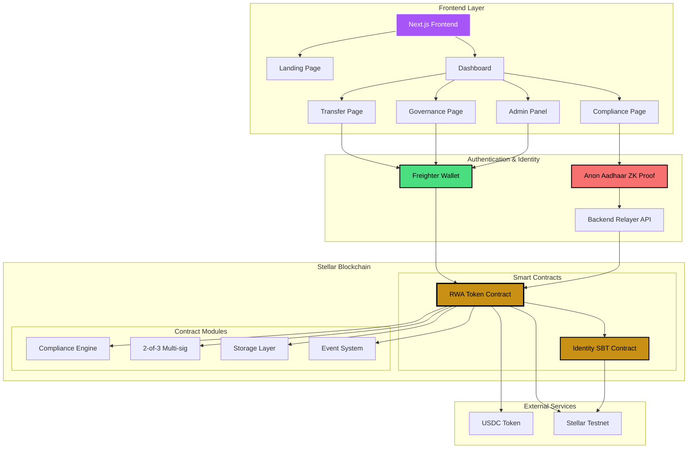
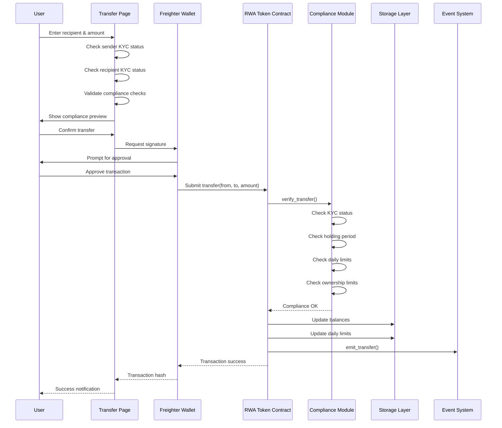
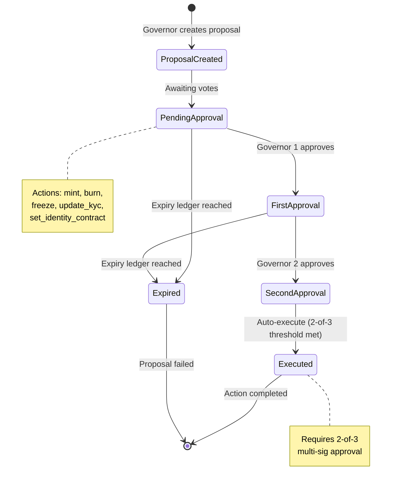

# AstraLink RWA Factory 🏭

> **"Shopify for Asset Tokenization"** — A production-grade platform for tokenizing real-world assets on the Stellar network with built-in compliance, identity, and yield streaming.

[](https://stellar.org)
[](https://soroban.stellar.org)
[](https://nextjs.org)
[](LICENSE)

---

## 🚀 Live Demo

**Contract ID:** `CBEHEOVOYODO7D62TFMNMI6EVK6NOLH7MLLUHNKWRGDZATP356YSHQL3`

[View on Stellar Explorer](https://stellar.expert/explorer/testnet/contract/CBEHEOVOYODO7D62TFMNMI6EVK6NOLH7MLLUHNKWRGDZATP356YSHQL3)

---

## 🌟 Overview

**AstraLink** solves the $16 trillion illiquid asset problem by providing a turn-key solution for asset managers to tokenize Real Estate, Private Equity, and Commodities. It combines institutional-grade compliance with DeFi composability.

### 💎 Key Features

#### 🛡️ Compliance & Identity
- **Decoupled Identity (SBT)**: Integrates with external Soulbound Tokens (like Anon Aadhaar) for checking "Humanity" or Accreditation without storing PII on-chain.
- **11-Step Compliance Engine**: Automated checks for KYC, AML, Accreditation, and Jurisdiction.
- **Multi-Jurisdiction**: Pre-configured rules for US (Reg D/S), Singapore (VCC), EU (MiCA), and UAE.

#### 💸 Yield Streaming
- **Automated Distributions**: Admin can deposit yield (e.g., USDC rent), and the contract calculates proportional shares for all holders.
- **Lazy Claiming**: Users claim yield in one click; no gas-heavy loops for distribution.
- **Real-Time Tracking**: Holders see pending yield accumulate in real-time.

#### 🔐 Security & Governance
- **2-of-3 Multi-Sig**: ALL critical operations (Mint, Burn, Freeze, Config) require approval from 2 out of 3 governors.
- **Emergency Controls**: Ability to freeze specific accounts or halt trading globally.
- **Asset Protection**: 90-day holding periods and ownership concentration limits (10% max) to prevent market manipulation.

---

## 🏗️ Technical Architecture

### System Architecture



### Smart Contract Modules

| Module | Description |
|--------|-------------|
| `lib.rs` | Main entry point. Handles token standard (SEP-41) + high-level logic. |
| `compliance.rs` | The "Policy Engine". Checks KYC, jurisdiction, and limits before any move. |
| `governance.rs` | Implements the proposal/vote/execute flow for multi-sig. |
| `types.rs` | Defines data structures (IdentityTrait, TransferRestrictions). |
| `storage.rs` | Efficient storage patterns (Instance vs Persistent) for gas optimization. |

### Transfer Operation Flow



### Governance State Machine



### Frontend Stack
- **Framework**: Next.js 15 (App Router), TailwindCSS, Framer Motion
- **Wallet**: Native integration with **Freighter**
- **Identity**: Anon Aadhaar ZK-proof verification
- **Features**:
  - **Admin Panel**: Issue tokens, freeze accounts, distribute yield
  - **Investor Dashboard**: View portfolio, check KYC status, claim yield
  - **Compliance View**: Real-time validation of transfer eligibility

---

## 🛠️ Getting Started

### Prerequisites
- Node.js 18+
- Rust & Cargo (latest stable)
- Stellar CLI (`cargo install --locked stellar-cli`)
- Freighter Wallet Extension

### 1. Clone & Install
```bash
git clone https://github.com/shinjinihehe/Solyrix-AstraLink-.git
cd Solyrix-AstraLink-

# Install Frontend Dependencies
cd frontend
npm install
```

### 2. Build Smart Contract
```bash
cd ../contracts/rwa-token
stellar contract build
# Output: target/wasm32-unknown-unknown/release/astralink_rwa_token.wasm
```

### 3. Deploy (Testnet)
```bash
# Generate Identity
stellar keys generate alice --network testnet

# Deploy
stellar contract deploy \
  --wasm target/wasm32-unknown-unknown/release/astralink_rwa_token.wasm \
  --source alice \
  --network testnet
```

### 4. Run Frontend
```bash
cd ../frontend
npm run dev
# Open http://localhost:3000
```

---

## 📱 User Guide

### For Asset Managers (Admins)
1. **Connect Wallet**: Use the Governor wallet (e.g., Alice).
2. **Mint Tokens**: Go to `Admin` > `Mint`. Propose a new mint for an investor.
3. **Distribute Yield**: Go to `Admin` > `Distribute Yield`.
   - Select currency (e.g., USDC).
   - Enter amount.
   - Click "Deposit".
   - *Yield is instantly allocated to all token holders.*

### For Investors
1. **Connect Wallet**: Use your Freighter wallet.
2. **View Balance**: See your RWA token balance and native XLM.
3. **Claim Yield**: 
   - Check the **"Unclaimed Yield"** card.
   - If > $0, click **"Claim Now"** to withdraw to your wallet.
4. **Transfer**: Send tokens to other KYC'd investors via the Transfer tab.

---

## 🗺️ Roadmap Status

- [x] **Phase 1: Core Foundation** (SEP-41 Token, Multi-Sig) ✅
- [x] **Phase 2: Compliance Engine** (11-Point automated checks) ✅
- [x] **Phase 3: Advanced Features** (Yield Streaming, Decoupled Identity) ✅
- [ ] **Phase 4: Oracle Integration** (Real-time asset valuation)
- [ ] **Phase 5: Mainnet Launch** (Audits & parameter tuning)

---

## 📄 License

MIT © AstraLink Team
